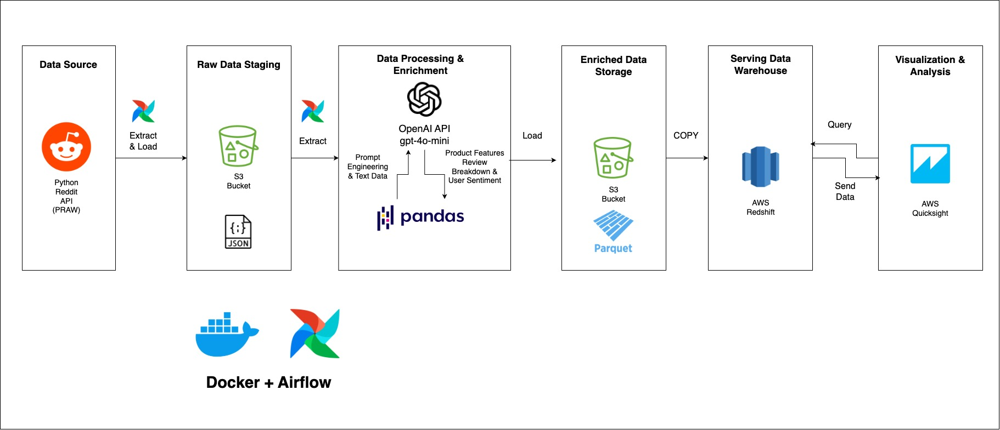
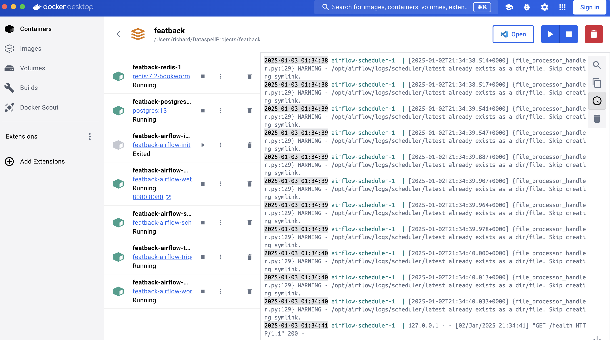
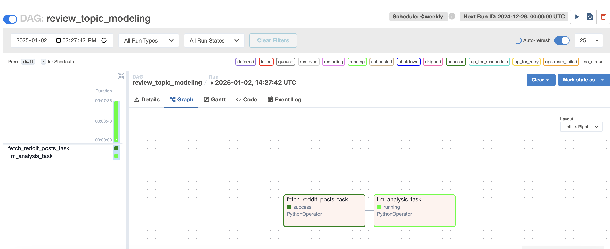
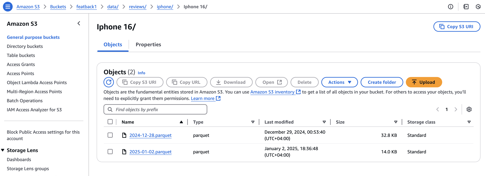
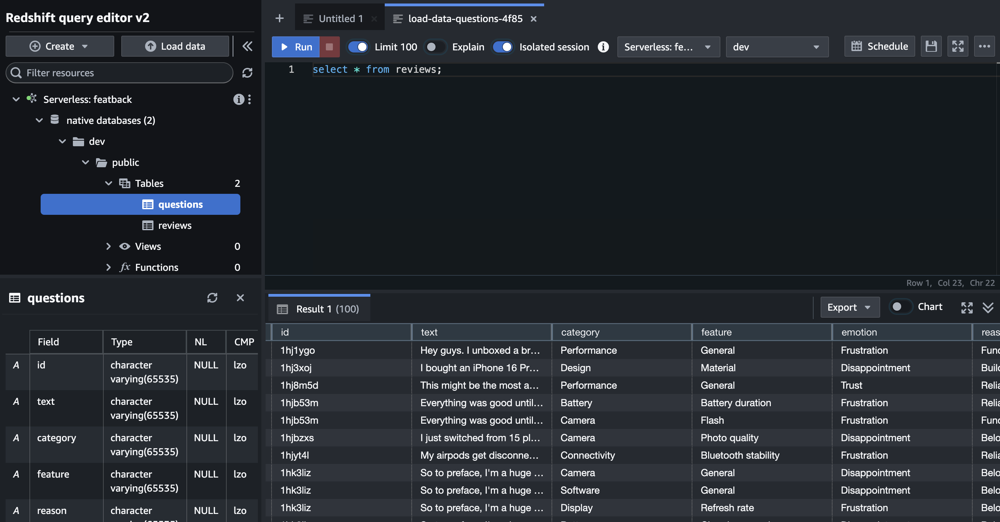
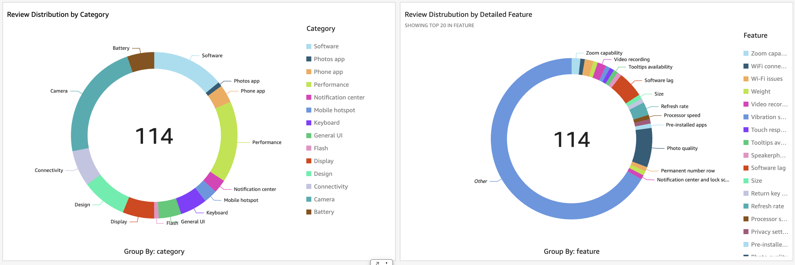
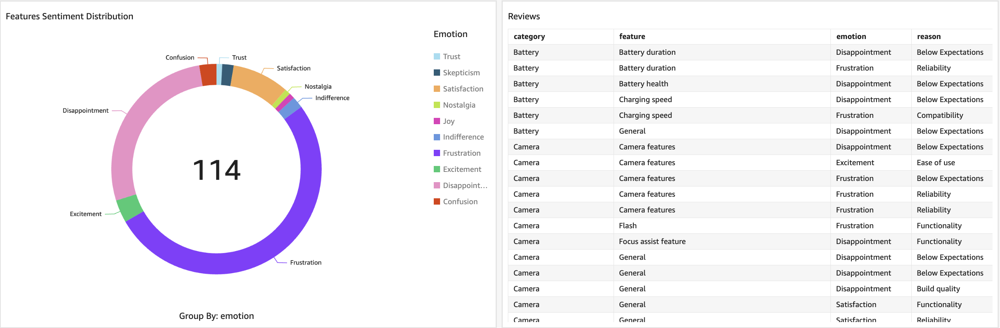
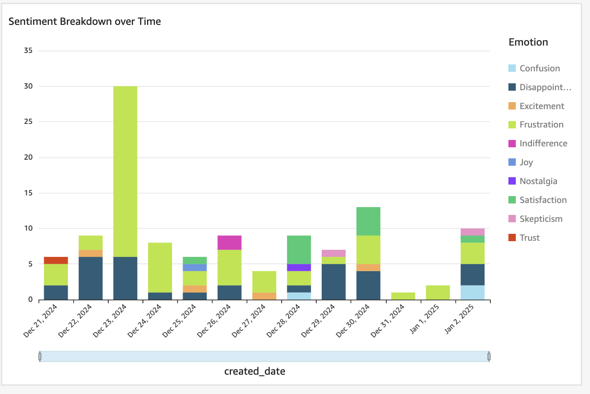

# Social Listening Tool: Feature-Based Reddit Analysis

## Welcome to Featback!!

Featback is a tool designed to help product management teams efficiently gather detailed analysis and granular feedback about specific features of their products. Unlike regular sentiment analysis, which often provides only a general sentiment score, Featback dives deeper to understand the drivers behind user emotions. Some features may be praised while others draw criticism, and Featback helps uncover these nuances.

For example, what do people think about the iPhone 16? What features are most commonly reviewed? What about the design do they not like—is it the colors or build quality? Regarding the camera, is it a UI functionality issue or a photo quality issue? Are users disappointed or frustrated?

Featback runs a pipeline every week to extract all Reddit posts in the iPhone 16 subreddit (Though it can be easily modified for any other product). It leverages the OpenAI API with prompt engineering techniques to identify whether each post is a review, a question, or neither. For reviews and questions, it breaks down each feature (e.g., Refresh Rate), categorizes it (e.g., Display), and provides the user emotion (e.g., Frustrated) along with the reason behind it (e.g., Functionality issue).


## Pipeline Diagram



## Key Technologies

- **AWS Services:**
    - S3: Stores both raw Reddit JSON data and processed feedback as Parquet files for scalable and efficient data management.
    - Redshift: Stores processed feedback for efficient querying and analysis.
    - QuickSight: Enables filtering and visualizing sentiment and insights for each product feature through interactive dashboards.
- **OpenAI API:**
    - gpt-4o-mini model
- **Docker:**
    - Fully containerized deployment using Docker Compose
- **Airflow:**
    - Orchestrates the entire pipeline, managing the automated flow of data from ingestion to analysis, storage, and visualization.
- **Some Key Python Libraries:**
    - `pandas`: For data manipulation and analysis.
    - `pyarrow`: To handle Parquet files for efficient data storage.
    - `boto3`: To interact with AWS services, including S3.
    - `redshift_connector`: For connecting to and querying Amazon Redshift.
    - `praw`: For fetching and processing Reddit posts.
    - `dotenv`: To manage sensitive credentials securely via .env files.
    - `openai`: For using GPT-4o-mini to extract insights from Reddit posts.

## Project Structure
```
project_directory/
├── dags/                
│   ├── main_dag.py              # Airflow DAGs for orchestrating the pipeline
├── scripts/                     # Python scripts for ingestion, analysis, and utilities
│   ├── configuration.py         # Centralized configuration management
│   ├── reddit_ingestion.py      # Fetching and storing Reddit posts
│   ├── s3_utils.py              # Utilities for S3 interaction
│   ├── data_processing.py       # Preprocessing and data transformation
│   ├── llm_utils.py             # Utilities for leveraging GPT-4o-mini
│   ├── redshift_utils.py        # Utilities for interacting with Redshift
│   ├── product_sentiment_analysis.py # Feature-based sentiment analysis
├── docker-compose.yml           # Docker Compose setup
├── Dockerfile                   # Dockerfile for containerized deployment
├── README.md                    # Project documentation
```

## Setup and Deployment
### Prerequisites
1. **AWS Credentials:** Ensure you have access keys with S3 and Redshift permissions.
2. **Redshift Access:** Set up an Amazon Redshift database and provide the endpoint, username, password, and IAM role ARN.
3. **Reddit API Credentials:** Set up a Reddit app to fetch posts using PRAW.
4. **OpenAI API Key:** Required for GPT-4o-mini integration.
5. **Docker Installed:** Ensure Docker and Docker Compose are installed.

### Environment Variables
Create a `.env` file with the following variables:
```env

# Airflow Setup
AIRFLOW_UID=501
AIRFLOW_GID=20

# AWS Credentials
AWS_ACCESS_KEY_ID=your_aws_access_key
AWS_SECRET_ACCESS_KEY=your_aws_secret_key

# Redshift Configuration
ENDPOINT=your_redshift_endpoint
AWS_USERNAME=your_redshift_username
AWS_PASSWORD=your_redshift_password
IAM_ROLE=your_iam_role_arn

# Reddit API Credentials
REDDIT_CLIENT_ID=your_reddit_client_id
REDDIT_CLIENT_SECRET=your_reddit_client_secret
REDDIT_CLIENT_AGENT=your_reddit_user_agent

# OpenAI API Key
OPENAI_API_KEY=your_openai_api_key
```

### Build and Run
1. Build and start the Docker containers:
   ```bash
   docker-compose up --build
   ```
2. Access the Airflow UI to trigger the pipeline:
    - Navigate to `http://localhost:8080`
    - Use default credentials: `airflow` / `airflow`


## Screenshots
### Docker Environment


### Airflow DAG run


### S3 Data Storage


### Redshift Example Query


### Quicksight Visualizations
#### Review Category and Feature Distribution

#### Sentiment Breakdown and Detailed Tabular View 

#### Sentiment Breakdown over Time



